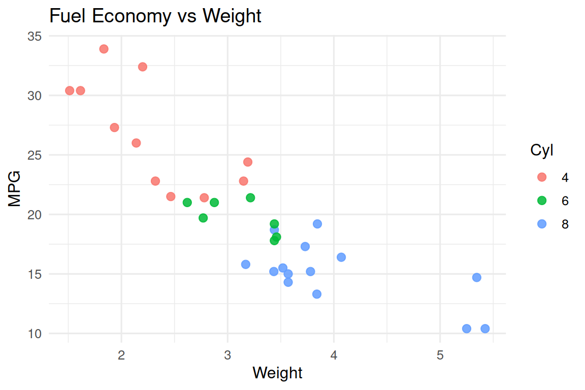
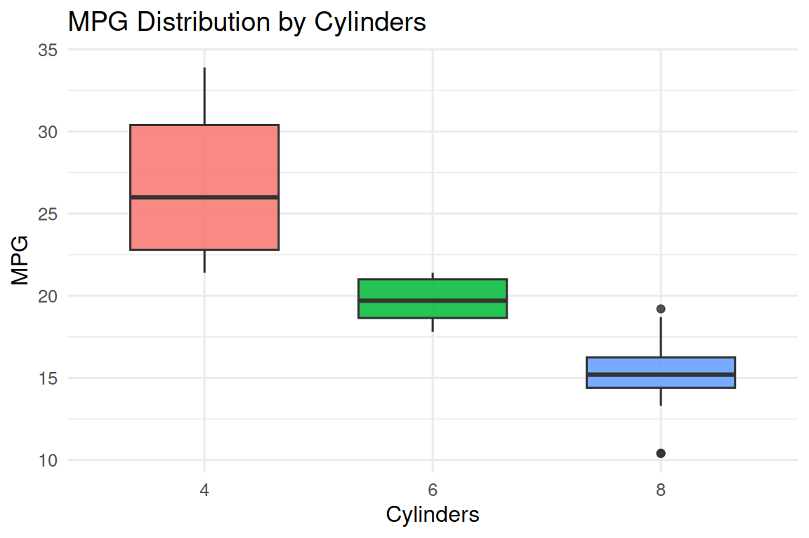
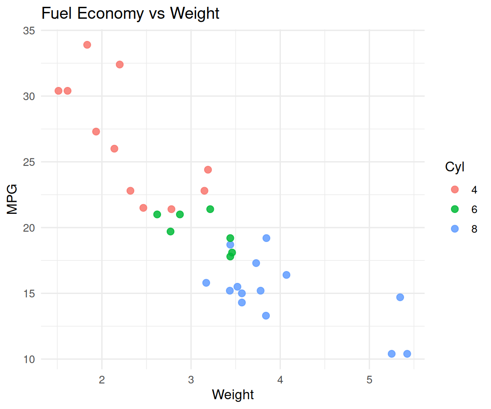
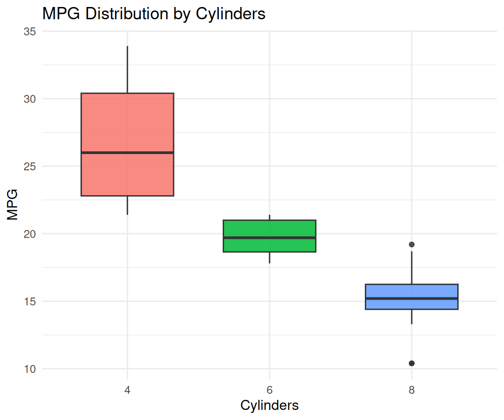

# Callout Tools

This article demonstrates the callout helpers in myquarto.

## Setup

``` r
library(myquarto)
library(ggplot2)
```

## Add Expand/Collapse Controls

``` r
render_callout_ui()
```

Use the buttons below to expand or collapse all sections.

Expand All

Collapse All

## Render Mixed Content in Callouts

``` r
fig_scatter <- ggplot(mtcars, aes(wt, mpg, color = factor(cyl))) +
  geom_point(size = 2.5, alpha = 0.85) +
  labs(title = "Fuel Economy vs Weight", x = "Weight", y = "MPG", color = "Cyl") +
  theme_minimal(base_size = 12)

fig_box <- ggplot(mtcars, aes(factor(cyl), mpg, fill = factor(cyl))) +
  geom_boxplot(alpha = 0.85, width = 0.65, show.legend = FALSE) +
  labs(title = "MPG Distribution by Cylinders", x = "Cylinders", y = "MPG") +
  theme_minimal(base_size = 12)

content_items <- list(
  "This section is plain Markdown content.\n\n- Item A\n- Item B",
  fig_scatter,
  fig_box,
  head(mtcars, 5),
  "Final notes with **bold text** and `inline code`."
)

render_callout_content(
  content_list = content_items,
  titles = c("Overview", "Figure: Scatter", "Figure: Boxplot", "Data Preview", "Notes"),
  callout_type = "note",
  collapse = TRUE
)
```

> **Overview**
>
> This section is plain Markdown content.
>
> - Item A
> - Item B

> **Figure: Scatter**
>
> 
>
> Example Plots

> **Figure: Boxplot**
>
> 
>
> Example Plots

> **Data Preview**
>
> |                   |  mpg | cyl | disp |  hp | drat |    wt |  qsec |  vs |  am | gear | carb |
> |:------------------|-----:|----:|-----:|----:|-----:|------:|------:|----:|----:|-----:|-----:|
> | Mazda RX4         | 21.0 |   6 |  160 | 110 | 3.90 | 2.620 | 16.46 |   0 |   1 |    4 |    4 |
> | Mazda RX4 Wag     | 21.0 |   6 |  160 | 110 | 3.90 | 2.875 | 17.02 |   0 |   1 |    4 |    4 |
> | Datsun 710        | 22.8 |   4 |  108 |  93 | 3.85 | 2.320 | 18.61 |   1 |   1 |    4 |    1 |
> | Hornet 4 Drive    | 21.4 |   6 |  258 | 110 | 3.08 | 3.215 | 19.44 |   1 |   0 |    3 |    1 |
> | Hornet Sportabout | 18.7 |   8 |  360 | 175 | 3.15 | 3.440 | 17.02 |   0 |   0 |    3 |    2 |

> **Notes**
>
> Final notes with **bold text** and `inline code`.

## Only figures

``` r
content_items <- list(
  fig_scatter,
  fig_box
)

render_callout_content(
  content_list = content_items,
  titles = c("Figure: Scatter", "Figure: Boxplot"),
  callout_type = "note",
  collapse = TRUE
)
```

> **Figure: Scatter**
>
> 
>
> Example Plots

> **Figure: Boxplot**
>
> 
>
> Example Plots
